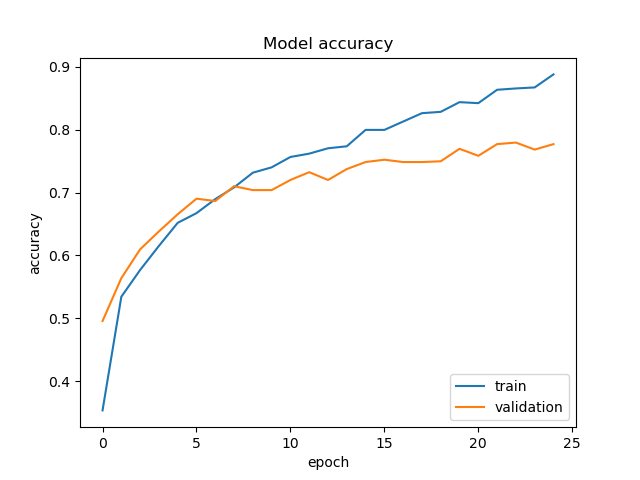
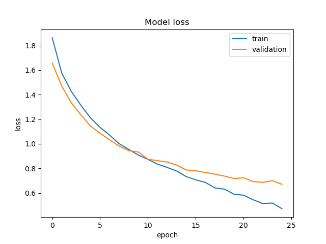
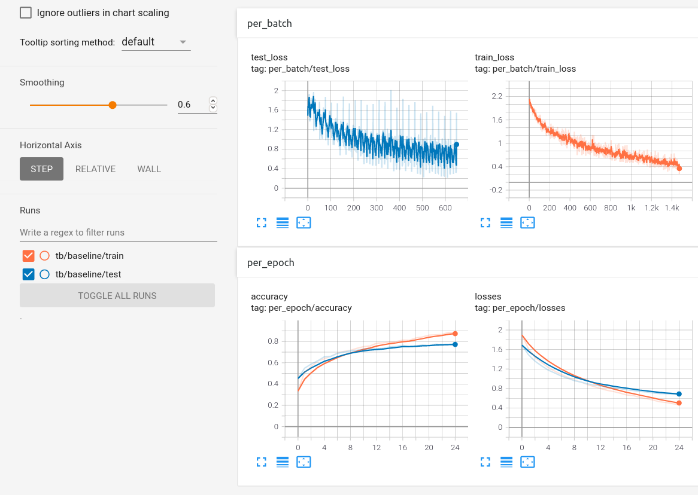

## Image Classification Task

This training script can be used to train a baseline image classification model on any dataset that is organized as

````
-DATASET
  -train
    -class1/*.jpg
    -class2/*.jpg
    -...
  -test
    -class1/*.jpg
    -class2/*.jpg
    -...
````
## Training Script Usage

Running training is as simple as

````
python train.py --data_path "/Datasets/MIT_split" --max_epochs 25 --lr 1e-4 --tb --plot_stats
````

### Full Script
````
$ python train.py -h
usage: train_aditya.py [-h] [--exp_name EXP_NAME] [--data_path DATA_PATH] [--max_epochs MAX_EPOCHS] [--lr LR] [--image_size IMAGE_SIZE]
                       [--batch_size BATCH_SIZE] [--num_workers NUM_WORKERS] [--save_model] [--tb] [--plot_stats]

A simple script for training an image classifier

optional arguments:
  -h, --help            show this help message and exit
  --exp_name EXP_NAME   name of experiment - for saving model and tensorboard dir
  --data_path DATA_PATH
                        path to Dataset
  --max_epochs MAX_EPOCHS
                        number of epochs to train the model for
  --lr LR               base learning rate to use for training
  --image_size IMAGE_SIZE
                        image size for training
  --batch_size BATCH_SIZE
                        batch size for training
  --num_workers NUM_WORKERS
                        number of workers for loading data
  --save_model          to save the model at the end of each epoch
  --tb                  to write results to tensorboard
  --plot_stats          to save matplotlib plots of train-test loss and accuracy
````

### Visualize Statistics
 
 You can either use tensorboard or plot the statistics as a matplotlib figure.

  - Matplotlib (using --plot_stats)

    
    


  - Tensorboard (using --tb)
    <br>  
    

